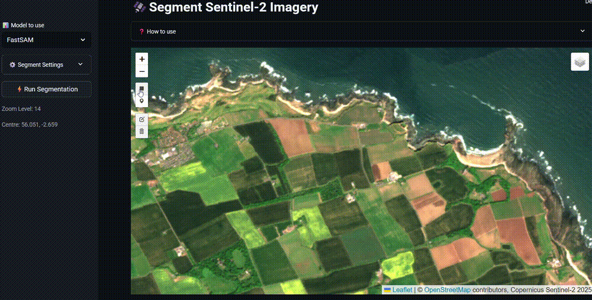

# rs-fastsam
A Streamlit app demonstrating zero-shot satellite image segmentation using lightweight variants of the [Segment Anything Model (SAM)](https://segment-anything.com/), such as [FastSAM](https://github.com/CASIA-IVA-Lab/FastSAM) and [MobileSAM](https://github.com/ChaoningZhang/MobileSAM). 

Experimental project to demonstrate how pre-trained SAM-family models (e.g., FastSAM, MobileSAM) can be applied to Sentinel-2 imagery over Scotland. The method is most effective for segmenting features with clear visual boundaries, such as agricultural fields and inland water bodies.




Once an image is segmented, the segments can be converted into polygon features. These polygons identify boundaries on the ground and can serve as units for further analysis. In the example included, multispectral bands and derived indices are used to classify the land use of each segmented polygon.

## Live Demos

- [Streamlit Cloud](https://rs-fastsam.streamlit.app) (free, but slower).
- [Railway](https://rs-fastsam.up.railway.app) (costs me, but faster).

## Models
This repository uses FastSAM, MobileSAM, and a scaled down variant of SAM2, via [Ultralytics]((https://www.ultralytics.com/) implementations for simplified deployment. These models can generate predictions quickly using a CPU.

## Imagery

The repository includes Copernicus [Sentinel 2](https://sentinels.copernicus.eu/web/sentinel/missions/sentinel-2) images for analysis images and a URL to a tile cache to visualise same image in the Streamlit Folium map interface. 

The `data/` directory includes two versions of a Sentinel-2 image captured on 16 May 2025:

- An 8-bit RGB image used for SAM-based segmentation

- A downsampled 16-bit multi-band image (including NIR, SWIR, and red-edge bands) used for post-segmentation land use classification

## Setup
### Prerequisites

- Python 3.12+
- Docker (optional, for containerized deployment)

### Without Docker

1. **Clone the repository**
   ```bash
   git clone https://github.com/your-username/rs-fastsam.git
   cd rs-fastsam
   ```

2. **Install dependencies**
   ```bash
   pip install -r requirements.txt
   ```

3. **Configure the application**
   - Copy and modify the configuration file as needed:
   ```bash
   cp config.yaml config.local.yaml  # Optional: create local config
   ```
   - Update paths in `config.yaml` to match your local setup

4. **Download required models**
   - The app will automatically download models from Ultralytics on the first run.
   - Or manually place model files in the `models/` directory as specified in `config.yaml`

5. **Run the application**
   ```bash
   streamlit run app.py
   ```

   - The app will be available at `http://localhost:8501`

### Using Docker

1. **Build the Docker image**
   ```bash
   docker build -t rs-fastsam .
   ```

2. **Run the container**
   ```bash
   docker run -p 8080:8080 rs-fastsam
   ```

### Configuration

Edit `config.yaml` to change:
- Paths to analysis imagery
- Map display settings and tile cache URL
- Default model inference parameters
- User-selectable parameter options for the UI

## Acknowledgments
This project makes use of the following tools and datasets:

- [Sentinel-2 imagery](https://sentinels.copernicus.eu/web/sentinel/missions/sentinel-2) — © European Space Agency (ESA) / Copernicus Programme
- [Segment Anything Model (SAM)](https://segment-anything.com/) — by Meta AI
- [FastSAM](https://github.com/CASIA-IVA-Lab/FastSAM) — by CASIA-IVA-Lab
- [MobileSAM](https://github.com/ChaoningZhang/MobileSAM) — by Chaoning Zhang et al.
- [SAM2](https://ai.meta.com/sam2/) — by Meta AI.
- [Ultralytics](https://www.ultralytics.com/) — for model implementations and deployment utilities

All trademarks, data, and code are the property of their respective owners and are used here for research and demonstration purposes.